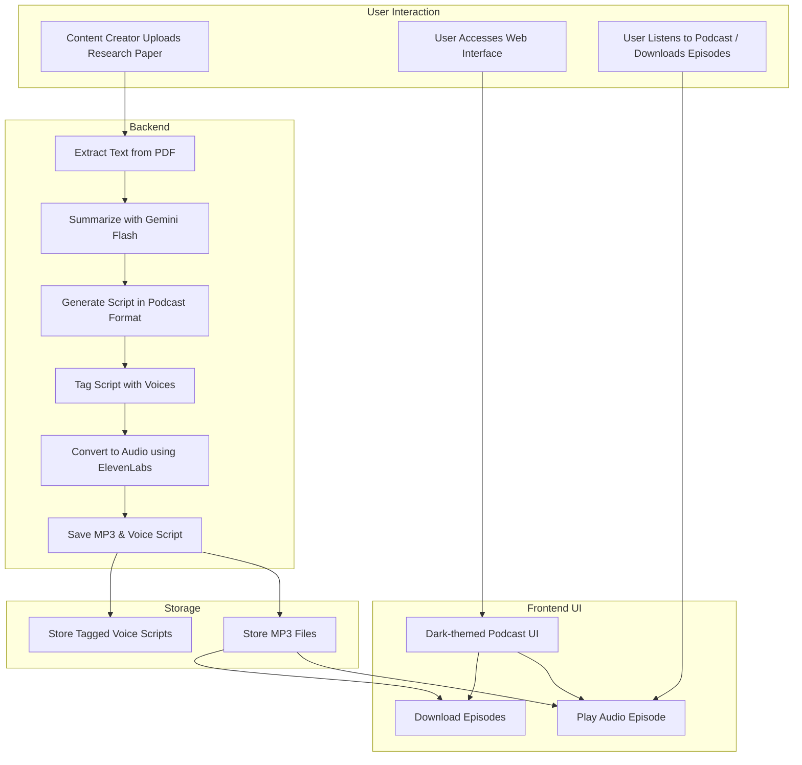

# TechnoNauts Impactathon'25 Project by Team Innovate Y

# 🎙️ PaperCast - Turning Research into Human-Like Podcasts

> **Listen to Learn. Anywhere, Anytime.**  
> 📡 Live Demo: [https://papercast.streamlit.app/](https://papercast.streamlit.app/)

---

## 🧠 What is PaperCast?

**PaperCast** is an intelligent platform that transforms dense and complex research papers into engaging, human-like podcast episodes. Designed for students, researchers, and curious minds on-the-go, PaperCast makes learning from academic papers easier, faster, and more accessible than ever before.

---

## 🧩 System Architecture

---

## 🌟 Features

- 📝 **Automatic Text Extraction** from uploaded PDF research papers.
- 🤖 **Smart Summarization** using Google Gemini LLM with research-optimized prompts.
- 🗣️ **Voice Generation** via ElevenLabs for natural, lifelike podcast narration.
- 🎧 **Dark, Minimal Podcast Web UI** built using React & Tailwind CSS.
- ☁️ **Streamlit Backend** for quick interactions and hosting.
- 📦 **Supabase Integration** for audio storage and access.
- 📱 **Mobile-friendly Design** mimicking real podcast apps.

---

## 🧰 Tech Stack

| Tool         | Purpose                                  |
|--------------|-------------------------------------------|
| `Python`     | Core processing, LLM integration          |
| `Streamlit`  | Lightweight backend interface             |
| `Google Gemini` | Research paper summarization            |
| `ElevenLabs` | AI voice synthesis for podcast-style audio|
| `Supabase`   | Storage of `.wav` audio and thumbnails    |
| `Mermaid.js` | For diagrams and architecture flowcharts  |

---

## 🎨 UI Highlights

- Discover & Trending Pages with smooth audio playback
- Interactive audio player with playlist view
- Responsive podcast card layout inspired by Spotify & YouTube
- Sidebar Navigation with seamless transitions
